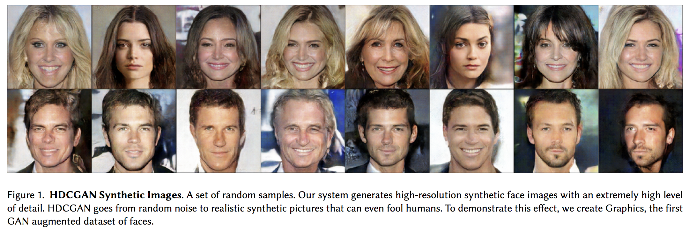

# Graphics

High-resolution Deep Convolutional Generative Adversarial Networks.

<a href="https://drive.google.com/file/d/1KM_aBTICkLqKUhV8sDhaGShtzP8EJCIY/view?usp=sharing">Link to Curtó & Zarza.</a>

<a href="https://share.weiyun.com/5Z5vaSc">Alternate Link 1 to Curtó & Zarza.</a>

<a href="https://share.weiyun.com/57WB7bw">Alternate Link 2 to Curtó & Zarza.</a>

For more information visit the website:

  http://www.decurto.ch/

If you use Curtó & Zarza in a publication, please cite the paper below:

        @article{Curto17_2,
          author = "J. D. Curt\'o and I. C. Zarza and F. Torre and I. King and M. R. Lyu",
          title = "High-resolution Deep Convolutional Generative Adversarial Networks",
          journal = "arXiv:1711.06491",
          year = "2017",
        }

--------------------------------------------------------
Change Log
--------------------------------------------------------

Version 1.0, released on 24/01/2019.

--------------------------------------------------------
File Information
--------------------------------------------------------

- Samples (graphics/samples/)**
  - 14,248 cropped faces. Balanced in terms of ethnicity. Mirror images included to enhance pose variation.
- Labels (labels/c&z.csv and labels/c&z.p)
  - CSV file with attribute information: Filename, Age, Ethnicity, Eyes Color, Facial Hair, Gender, Glasses, Hair Color, Hair Covered, Hair Style, Smile and Visible Forehead.
We also include format Pickle to load in Python.
- Code (scripts_tensorflow/classification.py and generate_subfolders.py)
  - Script to do classification using Tensorflow.
  - Script to generate adequate subfolder of specific attribute. Useful to load into frameworks of Machine Learning.
- HDCGAN Synthetic Images (graphics/hdcgan/)
  - 4,239 faces generated by HDCGAN trained on CelebA. Resized at 128x128.
- Additional Images (graphics/extra/samples/, labels/extra_c&z.csv and labels/extra_c&z.p)**
  - 3,384 cropped faces with labels. Ethnicity: White.

** Please note that we do not own the copyrights to these images. Their use is RESTRICTED to non-commercial research and educational purposes.
