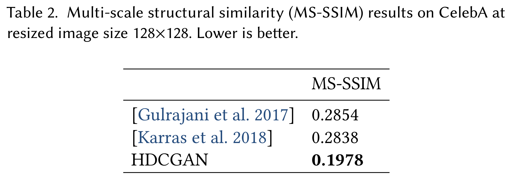
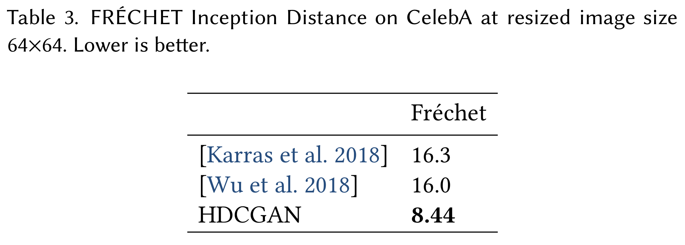

# Graphics

High-Resolution Deep Convolutional Generative Adversarial Networks

<a href="https://drive.google.com/file/d/1KM_aBTICkLqKUhV8sDhaGShtzP8EJCIY/view?usp=sharing">Link to Graphics</a>

For more information visit the website:

  http://www.curto.hk/publication/hdcgan/

If you use Graphics in a publication, please cite the paper below:

Curtó, J. D. and Zarza, I. C.
High-Resolution Deep Convolutional Generative Adversarial Networks. 2019.

--------------------------------------------------------
Change Log
--------------------------------------------------------

Version 1.0, released on 24/01/2019

--------------------------------------------------------
File Information
--------------------------------------------------------

- Images (graphics/samples/)**
  - 14,248 cropped face images. Balanced in terms of ethnicity. Mirror images included to enhance pose variation.
- Labels (labels/cz.csv & labels/cz.p)
  - CSV file with attribute information: Filename, Age, Ethnicity, Eyes Color, Facial Hair, Gender, Glasses, Hair Color, Hair Covered, Hair Style, Smile and Visible Forehead.
We also include Pickle format to load in Python.
- Code (scripts_tensorflow/classification.py & generate_subfolders.py)
  - Script to do classification benchmarks using Tensorflow.
  - Script to generate adequate subfolder of specific attribute. Useful to load into frameworks of machine learning.
- HDCGAN Synthetic Images (graphics/hdcgan/)
  - 4,239 face images generated by HDCGAN trained on CelebA. Resized at 128x128.
- Additional Images (graphics/extra/samples/, labels/extra_cz.csv & labels/extra_cz.p)**
  - 3,384 cropped face images with labels. Ethnicity: white.

** Please note that we do not own the copyrights to these images. Their use is RESTRICTED to non-commercial research and educational purposes.
